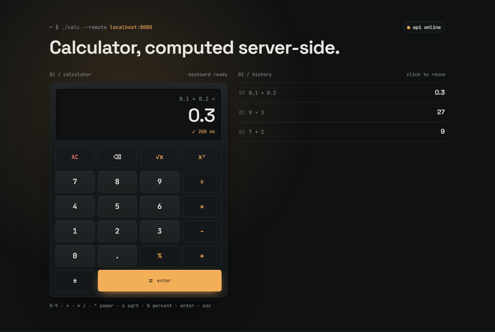

# Sezzle Calculator

A full-stack calculator: a **React + TypeScript** frontend where every operation is computed by a **Go REST API**.



- **Operations:** addition, subtraction, multiplication, division, exponentiation, square root and percentage.
- **Backend:** Go standard library only (no external dependencies), 100% statement coverage.
- **Frontend:** React 19, Vite, Tailwind CSS v4, Vitest + Testing Library, 100% line coverage.
- **Built with TDD:** the git history shows each red → green cycle (`test:` commit, then `feat:` commit).

## Contents

- [Project structure](#project-structure)
- [Getting started](#getting-started)
- [Running with Docker](#running-with-docker)
- [Tests and coverage](#tests-and-coverage)
- [API](#api)
- [Using the calculator](#using-the-calculator)
- [Design decisions](#design-decisions)
- [Assumptions and deviations from the design handoff](#assumptions-and-deviations-from-the-design-handoff)
- [AI usage](#ai-usage)

## Project structure

```
.
├── backend/                     Go REST API
│   ├── cmd/server/main.go       Entry point: config, server, graceful shutdown
│   └── internal/
│       ├── calculator/          Pure arithmetic + domain errors (no HTTP)
│       └── api/                 HTTP handlers, validation, error mapping, CORS
├── frontend/                    React + TypeScript app
│   └── src/
│       ├── api/client.ts        Typed fetch client and error mapping
│       ├── calculator/          Pure input state machine (reducer) and display model
│       ├── hooks/               useCalculator, useApiHealth, useKeyboard
│       ├── components/          Display, Keypad, Key, History, StatusPill, SectionLabel
│       └── lib/                 Number formatting, keyboard mapping, animations
├── docs/coverage/               Coverage reports (backend and frontend)
└── compose.yaml                 Runs both services with Docker
```

## Getting started

### Prerequisites

| Tool | Version |
|---|---|
| Go | 1.27+ |
| Node.js | 22+ |
| pnpm | 11 (enable it with `corepack enable`; the exact version is pinned in `package.json`) |

### Run the backend

```bash
cd backend
go run ./cmd/server
# listening on :8080 (CORS origin http://localhost:5173)
```

| Variable | Default | Description |
|---|---|---|
| `PORT` | `8080` | Port the API listens on |
| `CORS_ORIGIN` | `http://localhost:5173` | Origin allowed to call the API from a browser |

### Run the frontend

```bash
cd frontend
pnpm install
pnpm dev
# http://localhost:5173
```

| Variable | Default | Description |
|---|---|---|
| `VITE_API_URL` | `http://localhost:8080` | Base URL of the backend, used by the browser |

Other frontend scripts: `pnpm build`, `pnpm preview`, `pnpm lint`, `pnpm lint:fix`.

## Running with Docker

```bash
docker compose up --build
```

| Service | URL | Image |
|---|---|---|
| Frontend | http://localhost:5173 | Static build served by nginx |
| Backend | http://localhost:8080 | Go binary on Alpine, with a `HEALTHCHECK` on `/healthz` |

The two services keep separate origins, exactly like in development: the browser loads the frontend from port 5173 and calls the API on port 8080, so CORS is used in Docker too. The frontend waits until the backend is healthy before starting.

## Tests and coverage

```bash
# backend
cd backend
go test ./...
go test -coverprofile=coverage.out ./... && go tool cover -html=coverage.out

# frontend
cd frontend
pnpm test          # watch mode
pnpm coverage      # single run + text and HTML report in frontend/coverage/
```

Current reports are committed in [`docs/coverage/`](docs/coverage/):

| Layer | Tests | Coverage | Report |
|---|---|---|---|
| Backend (`internal/...`) | 98 | 100% of statements | [backend.txt](docs/coverage/backend.txt) · [backend.html](docs/coverage/backend.html) |
| Frontend (`src/`) | 173 | 100% lines · 99% branches | [frontend.txt](docs/coverage/frontend.txt) |

`cmd/server/main.go` has no unit tests on purpose: it only wires tested packages together (config, server, shutdown) and was verified by running it.

## API

Base URL: `http://localhost:8080`

### `POST /api/v1/{operation}`

| Operation | Body | Result |
|---|---|---|
| `add` | `{"a": 5, "b": 3}` | `a + b` |
| `subtract` | `{"a": 5, "b": 3}` | `a - b` |
| `multiply` | `{"a": 5, "b": 3}` | `a × b` |
| `divide` | `{"a": 6, "b": 3}` | `a ÷ b` |
| `power` | `{"a": 2, "b": 10}` | `a` raised to `b` |
| `percentage` | `{"a": 20, "b": 150}` | `a` percent of `b` (`a × b / 100`) |
| `sqrt` | `{"a": 16}` | square root of `a` (unary, `b` is not accepted) |

Success (`200 OK`):

```json
{ "operation": "add", "result": 8 }
```

Errors always use the same shape, with a stable `code` for clients and a human-readable `message`:

```json
{ "error": { "code": "DIVISION_BY_ZERO", "message": "division by zero" } }
```

| Status | Code | When |
|---|---|---|
| 400 | `INVALID_JSON` | Malformed JSON, wrong types (`"5"`), unknown fields, arrays, extra data after the object |
| 400 | `MISSING_OPERAND` | `a` or `b` is missing or `null` |
| 400 | `UNEXPECTED_OPERAND` | `b` sent to `sqrt` |
| 404 | `UNKNOWN_OPERATION` | The operation does not exist |
| 405 | — | Wrong HTTP method (handled by the Go router) |
| 413 | `PAYLOAD_TOO_LARGE` | Body larger than 1 KB |
| 422 | `DIVISION_BY_ZERO` | `b` is 0 in a division |
| 422 | `NEGATIVE_SQRT` | Square root of a negative number |
| 422 | `NON_FINITE_RESULT` | The result overflows or is undefined (`Inf`/`NaN`), e.g. `10^400` or `0^-1` |
| 500 | `INTERNAL_ERROR` | Unexpected error (details are not exposed) |

### `GET /healthz`

```json
{ "status": "ok" }
```

### Examples

```bash
curl -X POST localhost:8080/api/v1/add -H "Content-Type: application/json" -d '{"a": 5, "b": 3}'
# {"operation":"add","result":8}

curl -X POST localhost:8080/api/v1/percentage -H "Content-Type: application/json" -d '{"a": 20, "b": 150}'
# {"operation":"percentage","result":30}

curl -X POST localhost:8080/api/v1/sqrt -H "Content-Type: application/json" -d '{"a": 16}'
# {"operation":"sqrt","result":4}

curl -i -X POST localhost:8080/api/v1/divide -H "Content-Type: application/json" -d '{"a": 5, "b": 0}'
# HTTP/1.1 422 Unprocessable Entity
# {"error":{"code":"DIVISION_BY_ZERO","message":"division by zero"}}

curl -i -X POST localhost:8080/api/v1/add -H "Content-Type: application/json" -d '{"a": 5}'
# HTTP/1.1 400 Bad Request
# {"error":{"code":"MISSING_OPERAND","message":"operands \"a\" and \"b\" are required"}}

curl localhost:8080/healthz
# {"status":"ok"}
```

> On Windows PowerShell 5.1, `curl` is an alias for `Invoke-WebRequest`; run these from Git Bash or use `curl.exe`.

## Using the calculator

- Type with the keypad or the keyboard: `0-9`, `.` or `,`, `+ - * /` (`x` also multiplies), `p` power, `%` percentage, `s` square root, `Enter` or `=`, `Backspace`, `Esc`.
- Operations can be chained: `7 + 2 ×` computes `7 + 2` first and continues with `9 ×`.
- `√` is a prefix: press `√`, type the number, then `=` (or the next operator). `5 + √9 =` gives `8`.
- The history lists results newest first; click one to reuse it.
- The pill in the top right shows whether the API is reachable (polled every 15 s and updated on every request).

## Design decisions

### Backend

- **Business logic separated from HTTP.** `internal/calculator` receives numbers and returns `(float64, error)`; it knows nothing about JSON or status codes. `internal/api` validates input, calls the calculator and maps errors to HTTP. Each layer is tested on its own.
- **Sentinel errors** (`ErrDivisionByZero`, `ErrNegativeSqrt`, `ErrNonFiniteResult`) checked with `errors.Is`. The API maps them to status codes without comparing strings.
- **One route, one map of operations.** `POST /api/v1/{operation}` uses Go 1.22+ routing; operations live in a map, so adding one is a single line. Unary `sqrt` is adapted to the same signature.
- **POST with a JSON body** instead of query parameters: JSON keeps number types (`5` vs `"5"`) and is easy to extend.
- **400 vs 422.** 400 means the request is malformed; 422 means it is well-formed but has no result (like dividing by zero). This lets the client tell "fix your input" apart from "this operation is undefined".
- **No `Inf` or `NaN`.** Go does not panic on `x / 0.0` or overflow; it returns `Inf`/`NaN`, which `encoding/json` cannot encode. Every operation checks its result and returns `ErrNonFiniteResult` instead.
- **Strict input.** Pointer fields tell a missing operand from a `0`; unknown fields, trailing data and bodies over 1 KB are rejected.
- **Exact IEEE 754 results.** The API returns `0.1 + 0.2 = 0.30000000000000004`; rounding for display is a presentation concern and is done by the frontend. Tests compare floats with a tolerance (`1e-9`).
- **Production basics:** CORS limited to one configured origin (not `*`), server timeouts (including `ReadHeaderTimeout` against Slowloris), graceful shutdown on `SIGINT`/`SIGTERM`, and configuration through environment variables.
- **No dependencies.** Everything uses the standard library.

### Frontend

- **Pure logic, thin React layer.** The calculator input rules live in a reducer (`calculator/reducer.ts`) with no React or network code. Because a reducer cannot perform side effects, it only *describes* the request to make (`equalsRequest`, `sqrtRequest`); the `useCalculator` hook runs it and feeds the result back. This keeps most of the behavior testable with plain unit tests.
- **Display model.** `getDisplay(state)` derives what the display shows, so components only render.
- **Typed API client** that turns every failure (API error, network error, non-JSON response) into an `ApiError` with a code and message. The UI shows the server's `message`.
- **Number formatting on the client:** results are rounded to 12 significant digits and switch to exponential notation past 16 characters (`0.30000000000000004` is shown as `0.3`).
- **Tests use Testing Library the way a user would:** keys are found by accessible name (for example, `⌫` is announced as "backspace") and the integration tests click and type against a fake backend.
- **Accessibility and motion:** the result is an `<output aria-live>`, operators expose `aria-pressed`, and every animation is disabled when the user prefers reduced motion.
- **Tooling:** pnpm, Tailwind CSS v4 with the design tokens in `@theme`, and neostandard for linting. ESLint is pinned to v9 and TypeScript to v6.0 because those are the latest versions supported by neostandard's TypeScript plugin.

## Assumptions and deviations from the design handoff

- **Percentage** means "`a` percent of `b`" (`20 % of 150 = 30`). Values above 100 and negative percentages are allowed.
- **Square root is a prefix operator** (`√`, then the number) instead of applying immediately to the number on screen, which felt more natural to use.
- **Power shortcut** is `p` instead of `^`: `^` is a dead key on Spanish keyboard layouts, so the browser does not report it reliably.
- **Health check** is `GET /healthz` instead of `/api/v1/health`, a common convention for liveness probes.
- **Error codes** follow the backend, which is more specific than the handoff (for example `MISSING_OPERAND` and `NON_FINITE_RESULT` instead of `INVALID_OPERAND` and `OVERFLOW`, and 422 for domain errors). The UI only depends on the error message, plus its own `NETWORK` code when the API cannot be reached.
- **API status pill** has a third state, `checking api`, until the first health check answers, so the page does not flash "offline" on load.
- **Light theme** (optional in the handoff) is not implemented.

## AI usage

This project was built with Claude Code as a pair programmer, following TDD and reviewing each step. The prompts used are listed in [PROMPTS.md](PROMPTS.md).
